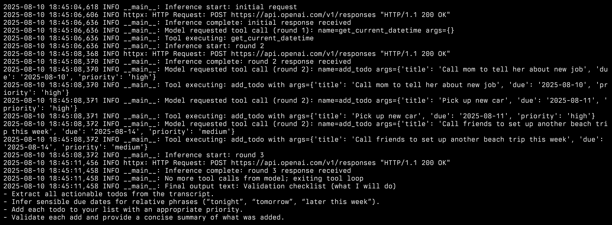
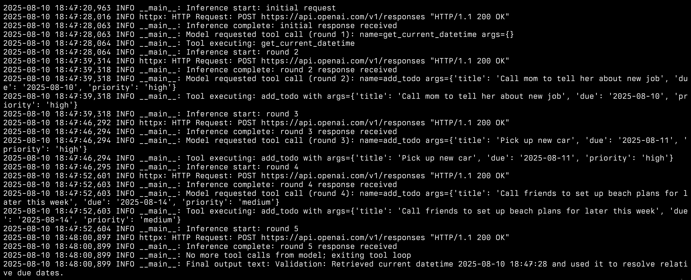
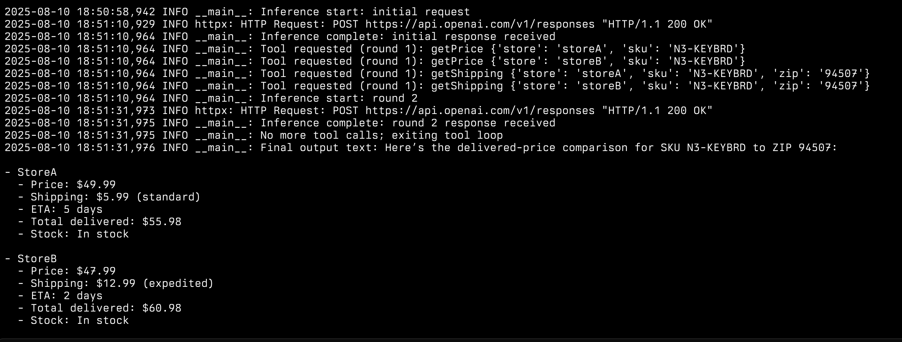
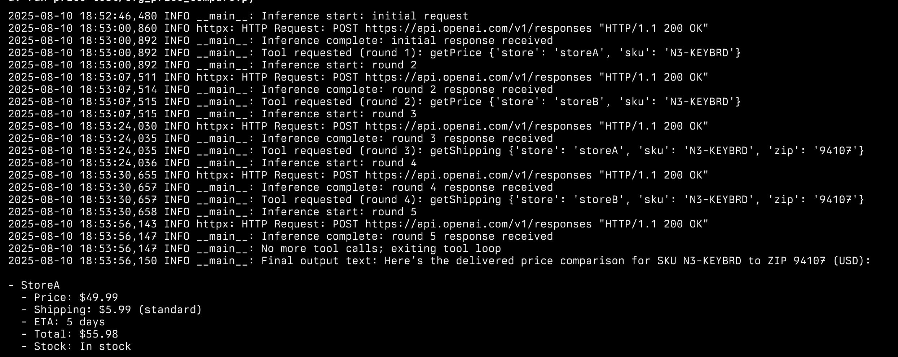
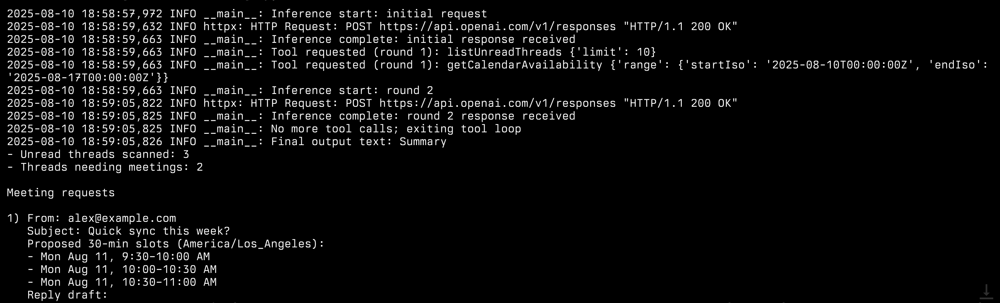
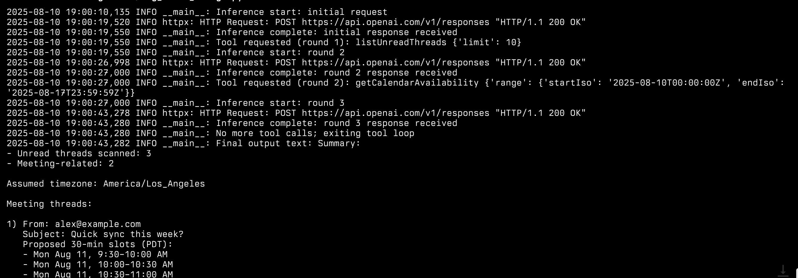

# GPT-5 CFG tool call testing

This is a pretty simple test of the GPT-5 CFG tool call functionality.

_this is not exhaustive and should not be taken as a comprehensive test of the GPT-5 CFG tool call functionality._

## FINDINGS

The weirdest thing I've been seeing is that whenever I use a CFG for my tool call, the model refuses to do tool calls in parallel. It will only do one tool call at a time.

I have zero clue why this is happening. Explanations are below; labeled screenshots are provided at the bottom.

### todos-test

**_THESE TESTS WERE DONE WITH GPT-5-MINI_**
I have been getting the same results with GPT-5 high reasoning effort.

| Mode             | API calls to OpenAI | Breakdown                                                                                                  |
| ---------------- | ------------------- | ---------------------------------------------------------------------------------------------------------- |
| normal functions | 3                   | 1 to get current date/time<br>1 to add 3 todos<br>1 for final summary                                      |
| cfg functions    | 5                   | 1 to get current date/time<br>1 to add 1 todo<br>1 to add 1 todo<br>1 to add 1 todo<br>1 for final summary |

### price-test

**_THESE TESTS WERE DONE WITH GPT-5 HIGH REASONING EFFORT_**

| Mode             | API calls to OpenAI | Breakdown                                                                                                                                                     |
| ---------------- | ------------------- | ------------------------------------------------------------------------------------------------------------------------------------------------------------- |
| normal functions | 2                   | 1 for 4 tool calls (price and shipping info)<br>1 for final summary                                                                                           |
| cfg functions    | 5                   | 1 to get price info tool call<br>1 to get shipping info tool call<br>1 to get price info tool call<br>1 to get shipping info tool call<br>1 for final summary |

### email-triage-test

**_THESE TESTS WERE DONE WITH GPT-5 MINIMAL REASONING EFFORT_**

| Mode             | API calls to OpenAI | Breakdown                                                                                                         |
| ---------------- | ------------------- | ----------------------------------------------------------------------------------------------------------------- |
| normal functions | 2                   | 1 with 2 tool calls (list unread threads and get calendar availability)<br>1 for final summary                    |
| cfg functions    | 3                   | 1 with 1 tool call (list unread threads)<br>1 with 1 tool call (get calendar availability)<br>1 for final summary |

## GETTING STARTED

This project uses uv for package management and running.

1. get an openai api key and add it to a `.env` file in the root of the project

```
OPENAI_API_KEY=sk-...
```

2. install dependencies

```
uv sync
```

3. run the tests

- `uv run todos-test/cfg_functions.py`
- `uv run todos-test/normal_functions.py`
- `uv run price-test/cfg_price_compare.py`
- `uv run price-test/price_compare.py`
- `uv run email-triage-test/cfg_email_triage.py`
- `uv run email-triage-test/email_triage.py`

4. check the output in the `output` directory (and see what tools are being called per request in the terminal output)

### Screenshots (labeled)

#### todos-test

- normal functions



- cfg functions



#### price-test

- normal functions



- cfg functions



#### email-triage-test

- normal functions



- cfg functions


